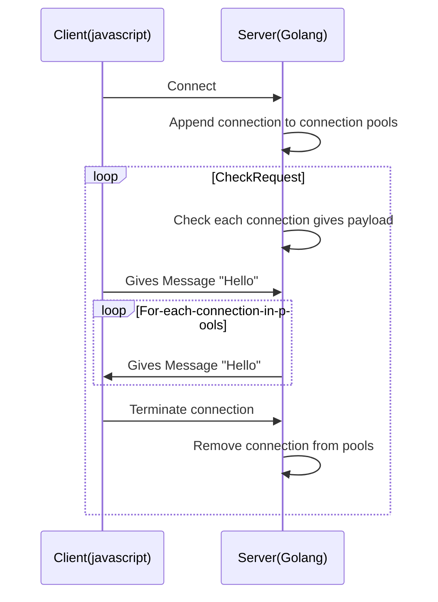

# Websocket exploratory
Here I learn about what is websocket and how to use it in golang, i will create a simple web-based messaging app. 

## Websocket
WebSocket is a protocol that provides full-duplex communication channels over a single TCP connection. It is built on top of HTTP and begins with an HTTP handshake to establish the connection. Once the WebSocket connection is established, it upgrades from HTTP to WebSocket and continues communication over TCP - ChatGPT

simple web chat and source code reference: https://dasarpemrogramangolang.novalagung.com/D-golang-web-socket-chatting-app.html
